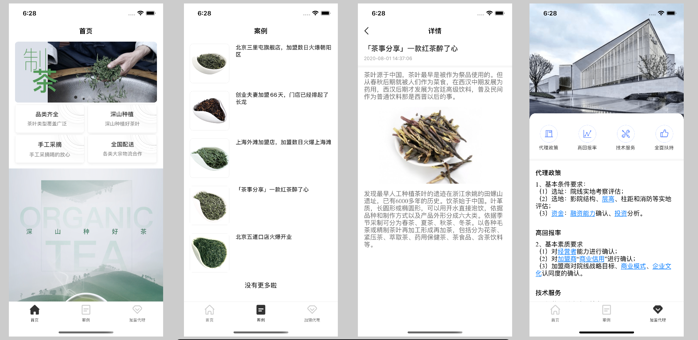
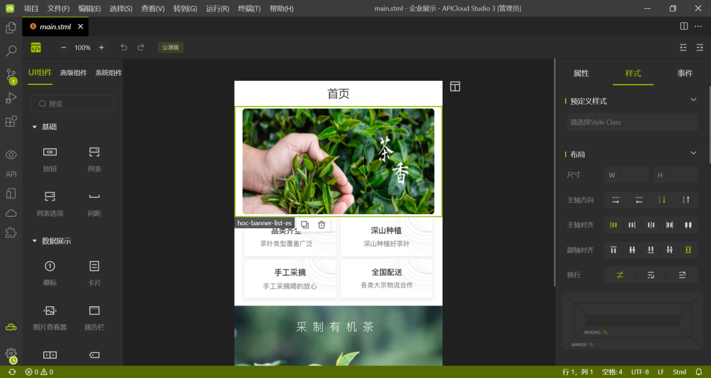
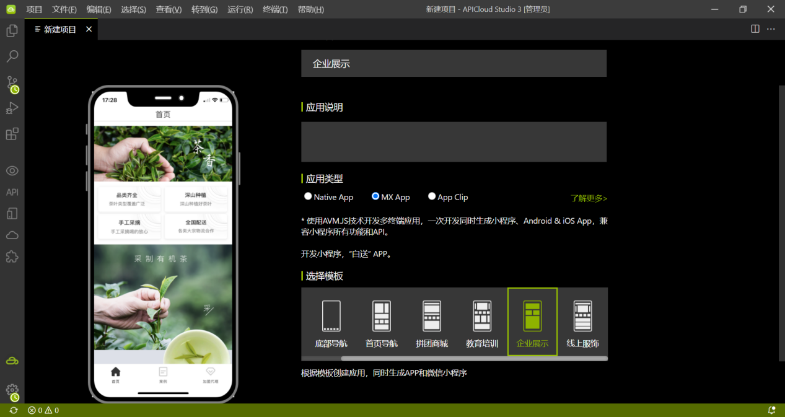
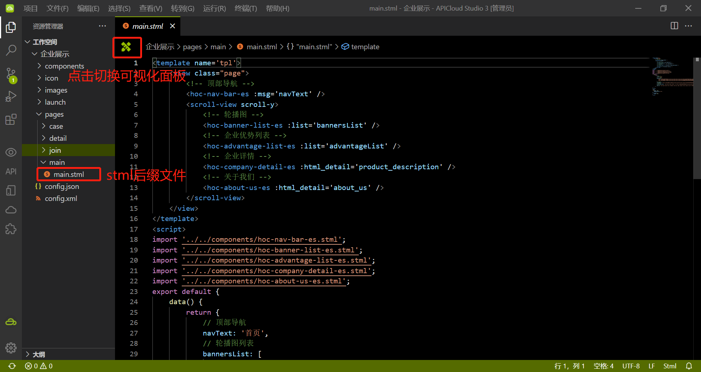
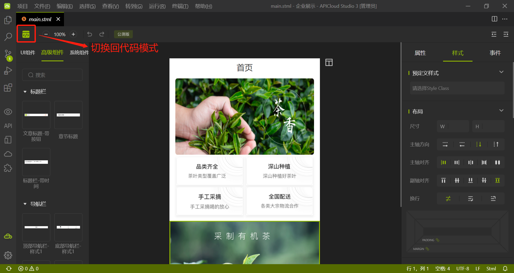

## 企业展示模板说明

### 项目介绍

此模板为企业展示类型，主要功能包括企业信息展示、案例展示、加盟申请等。通过此模板的使用能快速上手可视化编程开发技术，可以帮助企业快速拥有自己的网络名片，不但对企业的形象是一个良好的宣传，同时可以辅助企业销售，企业可以用来展示产品、案例、宣传企业文化、资讯动态等。

### 可视化界面显示以及预览截图

### 源码文件目录结构说明

项目源码在本仓库的 widget 目录下。其中该目录下的文件结构如下：

~~~text
┌─component/ // 项目公共组件目录
│ ├─hoc-banner-list-es.stml // [高级组件]轮播图组件
│ ├─hoc-advantage-list-es.stml // [高级组件]优势列表
│ ├─hoc-company-detail-es.stml // [高级组件]企业详情信息组件
├─images/ // 图片素材图标资源目录
├─pages/ // AVM页面目录
│ ├─main/
│ │ └─main.stml // 企业展示首页
│ ├─main/
│ │ └─main.stml // 企业展示首页
│ ├─case/
│ │ └─case.stml // 案例列表
│ ├─detail/
│ │ └─detail.stml // 案例详情
│ ├─join/
│ │ └─join.stml // 加入我们
│ ├─config.json// 顶部导航底部导航配置文件
└─config.xml // 应用配置文件
~~~

### 使用步骤

1. 下载最新版本的APICloud Studio 3
2. 下载成功后，安装后打开，顶部菜单选择【项目】-【新建项目】，填写应用名称，选择相应模板，点【完成】按钮进行创建。
  

4.创建完项目后打开stml格式文件，点击左上角图标可切换为可视化界面，可进行页面的设计，左侧栏可根据项目需求拖拽任意组件到画布中，右侧属性设置栏可对拖拽的组件进行设置。具体操作可查看 可视化工具的使用视频。

### 技术支持

使用中若有任何疑问可到APICloud论坛AVM多端专区发帖提问。官方技术支持和众多活跃开发者会第一时间为您提供技术支持。

### 项目地址

 https://github.com/apicloudcom/company-display_lc
